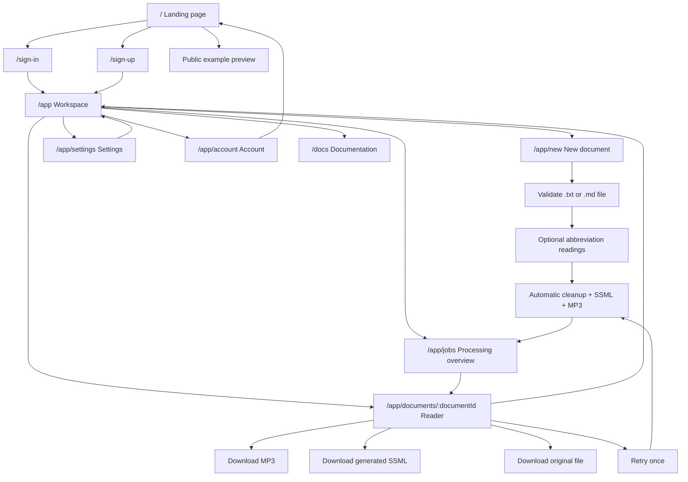
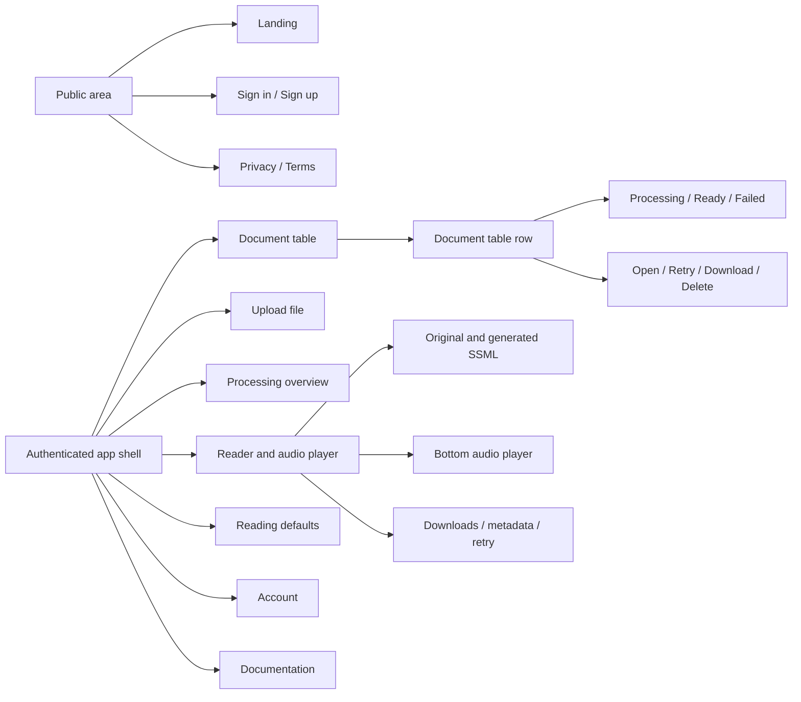
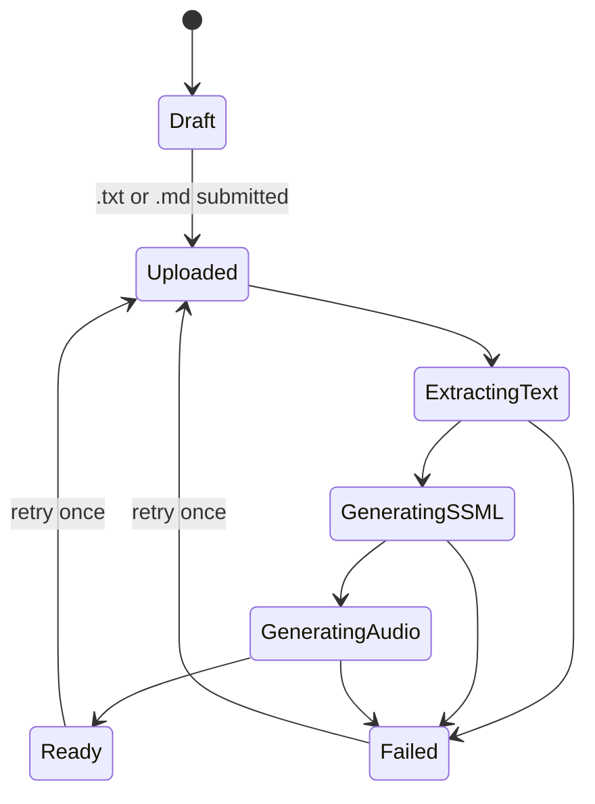

# PrzeczytajMi screen architecture

This document defines the front-end screens needed for PrzeczytajMi: a Polish document cleanup and text-to-speech application. It focuses on user-facing routes, navigation paths, screen responsibilities, states, and the main interaction model.

## Product assumptions

- Users upload Polish `.txt` or `.md` files that may contain noisy content: links, tags, headings, footers, metadata, repeated titles, markup, and formatting artifacts.
- The system automatically prepares Speech Synthesis Markup Language (SSML) optimized for AI reading, creates an MP3 narration, and lets the user review the original text, generated SSML, and audio output.
- Users need a private workspace with their uploaded files and generated results.
- Authentication is handled by Clerk, with sign-in and sign-up routes already expected by the project.
- MP3 generation happens automatically after upload; there is no manual review or edit step in v1.
- Each document can be retried once, which clears generated text/audio and reruns cleanup, SSML generation, and audio generation from the original uploaded file.
- Documents, generated SSML, and MP3 outputs are retained for one year.
- Billing is expected to be subscription-based, but plan details are not defined for v1.
- Mobile layouts are out of scope for v1; desktop experience is the design target.

## Recommended route map

| Route | Screen | Access | Primary purpose |
|---|---|---:|---|
| `/` | Landing page | Public | Explain value, show example, route users to sign in or start. |
| `/sign-in` | Sign in | Public | Authenticate existing users. |
| `/sign-up` | Sign up | Public | Create account. |
| `/app` | User workspace | Private | Show a table of uploaded files, statuses, and generated narrations. |
| `/app/new` | New document | Private | Upload a `.txt` or `.md` file, optionally define abbreviation readings, and start automatic processing. |
| `/app/jobs` | Processing overview | Private | Show all active and recent processing jobs with compact progress indicators. |
| `/app/documents/:documentId` | Document reader | Private | Review original/SSML text, play narration, track highlighted sentence, retry once, and download outputs. |
| `/app/settings` | Settings | Private | Set default model, voice, playback behavior, exports, and custom abbreviation readings for future documents. |
| `/app/account` | Account | Private | Manage profile, sign out, connected auth, and data deletion. |
| `/docs` | Documentation | Public or private | Technical-style product documentation, examples, supported files, and common errors. |
| `/privacy` | Privacy policy | Public | Explain document storage, retention, and AI processing. |
| `/terms` | Terms | Public | Legal terms. |

## User flow

## Information architecture

## Global app shell

Private pages should share one quiet, work-focused shell:

- Left sidebar on desktop with navigation: Documents, New document, Jobs, Settings, Documentation.
- Top bar with product name, current document title when applicable, processing status, account menu, and sign out.
- Mobile navigation is not specified for v1.
- Persistent toast region for upload, processing, download, and save events.
- Breadcrumbs on document detail pages: `Documents / Document title`.
- Main content width should be constrained for reading views, while the workspace table and processing overview may use the full available desktop width.

## Screen specifications

### Landing page `/`

Goal: quickly explain that PrzeczytajMi turns noisy Polish documents into SSML and generated narration.

Required sections:

- First viewport with product name `PrzeczytajMi`, short value proposition, sign-in button, sign-up button, and a secondary example/demo link.
- Animated or graphic example showing dirty source text transformed into SSML. Do not include audio playback on the landing page.
- Capability section: cleanup, reading markup, Polish voice generation, synchronized highlighting, downloads.
- Trust/privacy section explaining that documents are private to the user.
- Supported inputs section: `.txt` and `.md`.

Primary actions:

- `Zaloguj sie` routes to `/sign-in`.
- `Utworz konto` routes to `/sign-up`.
- Authenticated users should see `Przejdz do dokumentow` routing to `/app`.

States:

- Public anonymous state.
- Authenticated returning-user state.
- Loading auth state with disabled actions.

### Sign in `/sign-in` and sign up `/sign-up`

Goal: let users authenticate with minimal friction.

Required elements:

- Clerk auth form.
- Link back to landing page.
- Clear title matching action: `Zaloguj sie` or `Utworz konto`.
- Optional note that documents are stored in the user's private workspace.

Post-auth routes:

- Existing and new users route automatically to `/app`.

### Workspace `/app`

Goal: show the user's document library and transformation results in a dense table.

Required layout:

- Header with `Dokumenty`, search input, status filter, sort menu, and `Nowy dokument` button.
- Summary strip: total documents, currently processing, ready narrations, storage/export count if available.
- Document table as the primary layout.

Document table columns:

- Document title.
- Source type and upload date.
- Status: `Processing`, `Ready`, `Failed`.
- Voice/model used.
- Character count and generated audio length when available.
- Retry availability: `Retry available`, `Retry used`, or hidden when not applicable.
- Quick actions: open, download MP3, download SSML, download original file, retry, delete.

Empty state:

- Title: `Nie masz jeszcze dokumentow`.
- Action: `Dodaj pierwszy dokument`.
- Short example of what the app can clean.

Error state:

- If documents fail to load, keep the shell visible and show retry.

### New document `/app/new`

Goal: upload a supported file and start automatic cleanup, SSML generation, and narration.

Required flow:

1. Upload `.txt` or `.md` file.
2. Source preview: show file name, type, size, detected character count, and first lines of extracted text.
3. Optional abbreviation readings: let the user provide abbreviation and full reading text pairs.
4. Submit action: `Przygotuj tekst i audio`.

Abbreviation handling:

- Explain that PrzeczytajMi tries to read abbreviations correctly by default.
- Allow users to provide exact readings when they want control over a specific abbreviation.
- Each row should include `Abbreviation` and `Read as` fields, plus add/remove row controls.
- Examples: `PKP` -> `Polskie Koleje Panstwowe`, `ul.` -> `ulica`.
- These document-level abbreviation readings apply only to the uploaded document unless the user saves them as defaults in settings.

Validation:

- Reject unsupported file types with a specific explanation; v1 accepts only `.txt` and `.md`.
- Reject extracted text over 10,000 characters for v1.
- Warn on very short documents.
- Require exactly one uploaded file.
- Validate that abbreviation pairs are complete when provided.

After submit:

- Route to `/app/jobs` or back to `/app` with visible processing status.
- Do not show cleanup options in v1; cleanup behavior is internal.

Character limit note:

- A 10,000-character limit is reasonable for v1 if the goal is predictable latency, lower TTS cost, and simpler UI states.
- The UI should explain this as a version-one limit and show the detected character count before submission.

### Processing overview `/app/jobs`

Goal: make asynchronous cleanup and audio generation understandable without creating a per-document job page.

Required elements:

- List of active and recent jobs.
- Per-job status badge: uploaded, extracting text, generating SSML, generating MP3, ready, failed.
- Per-job progress bar when progress is available.
- Current step message.
- Link to the document when ready.
- Retry action for failed documents if retry has not been used.
- Non-blocking note that users can leave this page and return later.

Failure state:

- Show failed step, readable reason, retry action, and link to documentation.

### Document reader `/app/documents/:documentId`

Goal: combine reading, listening, review, and downloads in one focused screen.

Desktop layout:

- Main reading column with original text or generated SSML toggle.
- Sticky right side panel with document metadata, download actions, retry status/action, and processing details.
- Persistent bottom audio player spanning the main content area.
- Sentence-level highlight synced to audio playback.
- If processing is not ready, the route should render a full-screen warning that the user needs to wait and link to `/app/jobs`.

Required controls:

- Bottom player controls: play/pause, seek bar, speed control, previous sentence, next sentence.
- Right side panel actions: download MP3, download generated SSML, download original source file, retry once when available.
- Toggle original/generated SSML text.
- Toggle sentence highlights.

Text behavior:

- Current sentence highlight should be visually strong but not obscure text.
- Past sentences may use a subtle completed style.
- Clicking a sentence seeks audio to that sentence when the backend provides a text-to-audio timing map.
- V1 should expect a generated timing map rather than trying to infer timing purely from cleaned text in the browser.
- If timing map data is unavailable, show a no-sync fallback instead of guessing incorrect sentence timing.

States:

- Audio ready.
- Processing not ready: full-screen wait warning with link to `/app/jobs`.
- MP3 generation failed.
- Missing original file but generated SSML available.
- Empty extracted text.
- Retry available.
- Retry already used.

### Settings `/app/settings`

Goal: control defaults for future documents.

Sections:

- Reading model: default TTS model, fallback model.
- Voice: default Polish voice, voice preview, pronunciation style.
- Playback: default speed, sentence highlight behavior.
- Custom abbreviation readings for future documents.
- Exports: default output file names, MP3 quality, text format.
- Privacy: one-year retention notice, delete all documents if supported.

Required behavior:

- Settings affect future documents only.
- Show unsaved changes bar.
- Provide reset-to-defaults action.

### Account `/app/account`

Goal: profile and session management.

Required elements:

- Clerk profile/account management.
- Sign out.
- Email address.
- Data deletion request or direct delete flow if supported.
- Link to privacy policy.

### Documentation `/docs`

Goal: provide technical-style product documentation similar to common developer/product documentation sites.

Recommended content:

- Supported file formats: `.txt` and `.md`.
- 10,000-character limit and how it is counted.
- What cleanup changes.
- How SSML generation works at a high level.
- How reading pauses and pronunciation handling work.
- How custom abbreviation readings work.
- How to improve pronunciation.
- Common processing errors and fixes.
- Privacy and one-year retention summary.

## Suggested screens not in the original request

- `/app/new`: dedicated upload flow. Without this, the workspace table becomes overloaded.
- `/app/jobs`: aggregate processing overview. Audio generation can take time, but v1 does not need per-job detail routes.
- `/docs`: documentation-style help for file quality, Polish pronunciation, abbreviation handling, and failed jobs.
- `/privacy`: important because users upload private documents for AI processing.
- `/app/account`: account and deletion controls should not be buried inside settings.

## Core navigation rules

- Public users can only reach `/`, `/sign-in`, `/sign-up`, `/docs`, `/privacy`, and `/terms`.
- Private routes redirect anonymous users to `/sign-in`.
- After successful authentication, users are automatically redirected to `/app`.
- Authenticated users visiting `/` should see a direct route to `/app`.
- Processing starts automatically after upload.
- Finished processing jobs route to the reader.
- The reader should always provide a route back to the workspace and to `/app/jobs`.
- `/app/documents/:documentId` should not show partially processed documents; use the full-screen wait warning instead.

## Main object lifecycle

## Design direction

The product should feel like a focused document workspace, not a marketing-heavy AI toy.

- Use restrained, high-contrast typography and generous reading line height.
- Prioritize table scanning, playback controls, and clear processing states.
- Use tables for the workspace. Use cards only for modals or small repeated documentation examples.
- Prefer icons for repeated actions: upload, play, pause, download, settings, delete, retry.
- Use Polish UI copy by default.
- Keep long Polish labels from overflowing by designing flexible buttons and responsive wrapping.
- Treat desktop as the v1 target; responsive/mobile behavior can be specified after the core product is proven.

## Accessibility requirements

- All player controls must be keyboard accessible.
- Current sentence highlight must not rely on color alone.
- Audio player needs visible focus states and screen-reader labels.
- Processing status should announce step changes politely.
- Upload drop zone must also support a standard file input button.
- The generated timing map should be exposed in a way that lets assistive technology understand the currently active sentence.

## Resolved product decisions

- V1 supports `.txt` and `.md` files only.
- Users cannot paste text in v1.
- MP3 generation happens automatically after cleanup/SSML generation.
- Users cannot manually edit generated SSML before audio generation.
- Users can retry the whole pipeline once per document.
- `/app/documents/:documentId/edit` is not needed for v1.
- `/app/jobs` is an aggregate processing overview; there is no `/app/jobs/:jobId` route.
- Sentence highlighting should be driven by a backend-generated timing map.
- The product will be subscription-based, with details still undefined.
- Original files, generated SSML, and MP3 outputs are retained for one year.

## Open product decisions

- What exact subscription limits apply: documents per month, characters per month, storage, or generated audio minutes?
- What happens after the one retry is used and generation still fails?
- Should default abbreviation readings be global per user, grouped by document type, or both?
- Should `/docs` be fully public, or should some operational documentation require authentication?
